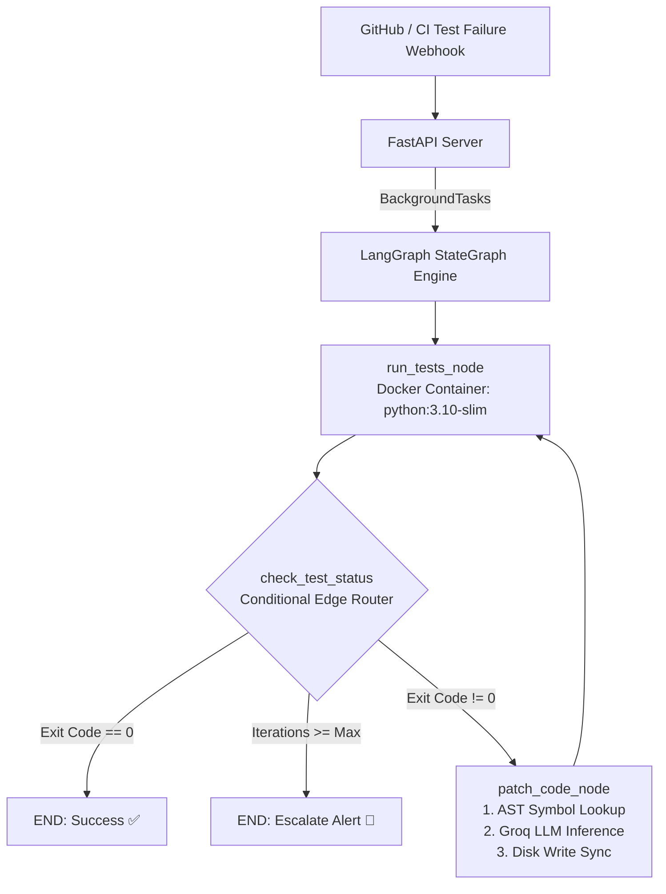

# Autonomous Self-Healing CI/CD Agent 🤖🛡️

An autonomous, closed-loop software reliability system designed to intercept failing continuous integration workflows, parse runtime diagnostics, traverse abstract syntax trees to locate root-cause symbols, generate syntactically safe patches via large language models, and verify repairs within ephemeral Docker execution sandboxes orchestrated by a LangGraph StateGraph.

---

## 📑 Table of Contents
- Executive Overview
- System Architecture & Workflow Diagram
- Core Engineering Subsystems
  - 1. Ephemeral Docker Execution Sandbox
  - 2. Deterministic Traceback & Failure Parsing
  - 3. Static AST Symbol Mapping & Dependency Traversal
  - 4. LangGraph StateGraph Finite State Machine
  - 5. Asynchronous FastAPI Webhook Ingestion
- Design Decisions & Technical Trade-offs
- Repository Layout
- Getting Started & Installation
- Operational Runbook & Verification

---

## 🔭 Executive Overview

Traditional continuous integration systems operate on a passive failure model: when tests fail, the CI pipeline halts, logs are written to an artifact registry, and an alert is broadcast to developers, leaving the manual burden of reproduction, root-cause diagnosis, patching, and verification entirely on humans.

This project implements an active, self-healing CI loop:
- Zero Host Risk: Untrusted code patches and dynamic test suites are never executed on the host system. All execution takes place inside disposable Linux containers (python:3.10-slim).
- Context-Window Economy: Rather than dumping entire multi-file codebases into an LLM context window (which leads to context dilution, hallucination, and token exhaustion), static analysis via Python's Abstract Syntax Tree (ast) identifies the precise file and line range of buggy symbols.
- Deterministic Orchestration: Avoids unconstrained, non-deterministic agent loops by enforcing a formal Finite State Machine (FSM) via LangGraph, bounding execution to discrete states, explicit data contracts, and immutable iteration limits.

---

## 🏛️ System Architecture & Workflow Diagram

---

## ⚙️️ Core Engineering Subsystems

### 1. Ephemeral Docker Execution Sandbox
Dynamic test execution against AI-generated code introduces arbitrary execution risks (infinite loops, system corruption, unverified network requests). The sandbox layer enforces strict isolation:
- Image Runtime: Built upon python:3.10-slim.
- Bidirectional Volume Bind Mount: Mounts the host repository directory to /workspace inside the container (mode="rw"). Edits made by the repair agent on the host disk immediately project into the container without requiring image rebuilds or layer invalidations.
- Environment Isolation: Executes tests with PYTHONPATH=/workspace pytest -v /workspace/tests, isolating package imports from host site-packages.
- Guaranteed Teardown: Container lifecycles are wrapped in try/finally blocks, enforcing container.remove(force=True) to prevent orphaned containers from consuming host system memory.

### 2. Deterministic Traceback & Failure Parsing
Raw CLI outputs from pytest contain ANSI formatting, environment warnings, and execution progress indicators that pollute LLM context windows. 
- The module traceback_parser.py implements regex matching routines to extract structured metadata:
  - Failing test node identity (e.g., tests/test_calculator.py::test_percentage_calculation)
  - Error category (AssertionError, TypeError, ZeroDivisionError)
  - Target symbol and callsite traceback lines
- Isolating the failure log reduces prompt sizes by up to 80% while sharpening diagnostic fidelity.

### 3. Static AST Symbol Mapping & Dependency Traversal
When a test fails, identifying which module defines the offending symbol across a multi-tier package layout cannot depend on flat text matching (which falsely flags comments, strings, or docstrings).
- The module repo_mapper.py subclasses ast.NodeVisitor to construct an in-memory symbol index of all .py files:
  - Traverses syntax nodes representing ast.FunctionDef, ast.AsyncFunctionDef, and ast.ClassDef.
  - Captures exact file paths, line ranges, and function signatures.
  - Exposes find_symbol_file(repo_map, symbol_name) to instantly provide the absolute path of the implementation needing inspection.

### 4. LangGraph StateGraph Finite State Machine
To avoid the instability of free-form ReAct loops, execution is formalized as a directed state graph:
- Structured Schema (AgentState):
  - repo_path: Target file tree path.
  - test_passed: Boolean flag determining completion.
  - error_logs: Sanitized execution traces from Docker stdout/stderr.
  - iteration: Current repair cycle count.
  - max_iterations: Bounded loop guardrail (default: 3).
- Conditional Routing: Evaluates state after every test run, routing to termination if passing, routing to patch generation if failing within retry budget, or halting execution if the iteration threshold is exceeded.

### 5. Asynchronous FastAPI Webhook Ingestion
The entry point server.py interfaces external CI/CD engines (such as GitHub Actions) with the internal LangGraph engine:
- Exposes POST /webhook expecting a JSON payload containing the repository name, branch, and failure trigger reason.
- Offloads graph execution to FastAPI BackgroundTasks, returning an immediate 202 Accepted response to prevent webhooks from timing out during long-running repair attempts.

---

## ⚖️ Design Decisions & Technical Trade-offs

- Test Execution Environment: Docker Bind Mount (rw) over Ephemeral Container copy
  - Justification: Bind mounting eliminates the multi-second overhead of copying files into and out of container layers between test iterations.
- Code Inspection: Native ast Visitor over Full Text Grep / Regex
  - Justification: AST inspection eliminates false positives generated by commented-out code, string literals, and documentation examples.
- Agent Architecture: LangGraph StateGraph over Unconstrained ReAct Loop
  - Justification: A finite state machine bounds model agency to patching only, preventing tool-ordering hallucinations and unbounded token burn.
- Inference Backend: Groq LPU (openai/gpt-oss-120b) over Free-tier API rate limits
  - Justification: Ultra-low latency allows rapid multi-turn repair iterations without triggering token bucket rate limits (429 errors).

---

## 📁 Repository Layout

self-healing-ci-agent/
├── docker_sandbox.py       # Isolated container testing runtime & cleanup logic
├── graph_agent.py          # StateGraph workflow engine, schema, and node logic
├── repo_mapper.py          # Static AST scanner and symbol table builder
├── repair_agent.py         # Baseline single-loop prototype agent
├── server.py               # Asynchronous FastAPI webhook receiver
├── test_docker.py          # Docker daemon connection validation utility
├── traceback_parser.py     # Deterministic regex traceback parser
├── sandbox_repo/           # Target code environment under continuous test
│   ├── src/
│   │   ├── __init__.py
│   │   ├── calculator.py   # Multi-module business logic
│   │   └── math_helpers.py # Target utility functions
│   └── tests/
│       ├── __init__.py
│       └── test_calculator.py # Pytest validation suite
├── requirements.txt        # Top-level dependencies
└── README.md               # Technical documentation

---

## 💻 Getting Started & Installation

### Prerequisites
- Python 3.10 or higher
- Docker Desktop installed and actively running
- Groq API Key

### 1. Repository Setup & Virtual Environment (Windows PowerShell)
python -m venv venv
.\venv\Scripts\Activate.ps1
pip install -r requirements.txt

### 2. Environment Configuration
Create a .env file in the project root:
GROQ_API_KEY=your_groq_api_key_here

---

## 🧪 Operational Runbook & Verification

### Scenario A: Standalone StateGraph Execution
1. Open sandbox_repo/src/math_helpers.py and introduce an intentional logic bug:
   def percentage(part: float, whole: float) -> float:
       return (part / whole) * 10  # Bug: Correct multiplier is 100
2. Run the graph workflow:
   python graph_agent.py
3. Verify that run_tests fails on iteration 1, routes to patch_code, writes the fix to disk, re-executes tests in Docker, and exits with PASSED.

### Scenario B: CI/CD Webhook Trigger
1. Launch the FastAPI service:
   python server.py
2. Open a separate terminal and issue a mock CI/CD failure webhook:
   Invoke-RestMethod -Uri "[http://127.0.0.1:8000/webhook](http://127.0.0.1:8000/webhook)" -Method POST -Headers @{"Content-Type"="application/json"} -Body '{"repo_name": "sandbox_repo", "branch": "main", "trigger_reason": "test_failure"}'
3. Observe the asynchronous trigger dispatch in the server console and confirm the repair cycle executes to completion in the background.

---

## 🧗 Challenges Faced & Solutions

### 1. Finding Which File Actually Had the Bug
- **The Problem:** When a test fails, the error message indicates what failed, but not where the broken function is implemented across multiple project files. Simple text search often returned false positives like comments, tests, or docstrings.
- **The Fix:** Used Python's built-in `ast` (Abstract Syntax Tree) module in `repo_mapper.py` to parse the project's code structure and map every function and class directly to its exact file.

### 2. Preventing Infinite AI Repair Loops
- **The Problem:** If an automated patch introduced a new bug, a basic agent loop could repeatedly attempt fixes indefinitely, burning API tokens and getting stuck in cycles.
- **The Fix:** Built the workflow using LangGraph as a finite state machine with strict condition checks and a hard limit of 3 repair attempts before stopping and alerting the user.

---

## ⚠️ Current Limitations

- **Single-File Fixes Only:** The agent is designed to find and patch one broken function or file at a time. It cannot yet resolve complex bugs that require simultaneous changes across multiple different files.
- **Python-Specific:** The AST scanner and Docker test environment currently only support Python codebases and `pytest` test suites.
- **Local Sandbox Setup:** The system is built to test within a local repository folder. It does not yet connect directly to live cloud GitHub repositories or multi-tenant servers.