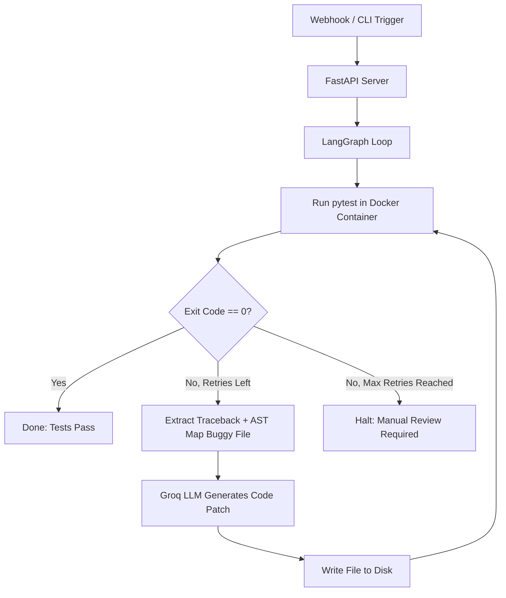

# Self-Healing Test Repair Agent

A localized test-repair loop that uses static analysis (Python AST) to locate failing functions, an LLM (Groq) to generate patches, and an isolated Docker container to verify the fix.

## Architecture



## How It Works

1. **Test Execution**: Runs `pytest` inside an ephemeral `python:3.10-slim` container. The local project directory is bind-mounted to `/workspace` so test runs are isolated from host dependencies.
2. **Failure Extraction**: Extracts the failing test name and failure exception from the `pytest` output using regex patterns.
3. **Symbol Resolution**: Traverses the repository's syntax tree using Python's `ast` module to locate the exact source file defining the failed function or class, avoiding brute-force text search.
4. **Patching**: Prompts Groq (`openai/gpt-oss-120b`) with the failure trace and the target source code.
5. **State Loop**: Orchestrated with LangGraph as a finite state loop with a hard cap of 3 repair attempts.
6. **Webhook Receiver**: A lightweight FastAPI server exposes a POST `/webhook` endpoint to trigger the repair loop asynchronously using background tasks.

## Project Structure

```
.
├── docker_sandbox.py   # Container runner (pytest execution, cleanup)
├── graph_agent.py      # LangGraph workflow and state nodes
├── repo_mapper.py      # AST-based symbol locator
├── traceback_parser.py # Regex failure log extractor
├── server.py           # FastAPI webhook receiver
├── sandbox_repo/       # Local target repository used for testing
│   ├── src/            # Application logic
│   └── tests/          # Pytest suite
├── requirements.txt    # Project dependencies
├── Dockerfile          # Containerfile for the webhook service
└── .env.example        # Environment template
```

## Setup & Running

### Prerequisites
- Python 3.10+
- Docker Desktop running
- Groq API Key

### Installation

```bash
# Clone the repository
git clone https://github.com/Adityaraj1005/self-healing-ci-agent.git
cd self-healing-ci-agent

# Set up virtual environment
python -m venv venv
source venv/bin/activate  # On Windows: .\venv\Scripts\Activate.ps1
pip install -r requirements.txt

# Configure environment
cp .env.example .env
# Edit .env and insert your GROQ_API_KEY
```

### Running the Repair Loop

1. Introduce an intentional logic bug in `sandbox_repo/src/math_helpers.py`:
   ```python
   def percentage(part: float, whole: float) -> float:
       return (part / whole) * 10  # Bug: should be * 100
   ```
2. Run the graph agent directly:
   ```bash
   python graph_agent.py
   ```
3. Or start the webhook receiver and post a failure event:
   ```bash
   python server.py
   ```
   In a separate terminal:
   ```bash
   curl -X POST http://127.0.0.1:8000/webhook \
     -H "Content-Type: application/json" \
     -d '{"repo_name": "sandbox_repo", "branch": "main", "trigger_reason": "test_failure"}'
   ```

## Limitations & Known Trade-offs

- **Local Scope**: Operates on a local directory bind-mount; it does not clone remote Git repositories or create GitHub Pull Requests.
- **Single-Symbol Resolution**: The AST locator resolves individual top-level functions and classes. It cannot resolve multi-file regressions or cross-module refactors.
- **Language Constraint**: Only Python source code and `pytest` execution are supported.
- **Test Integrity**: The repair loop must explicitly restrict edits to `src/` to prevent the model from modifying assertions inside `tests/` to achieve a passing state.